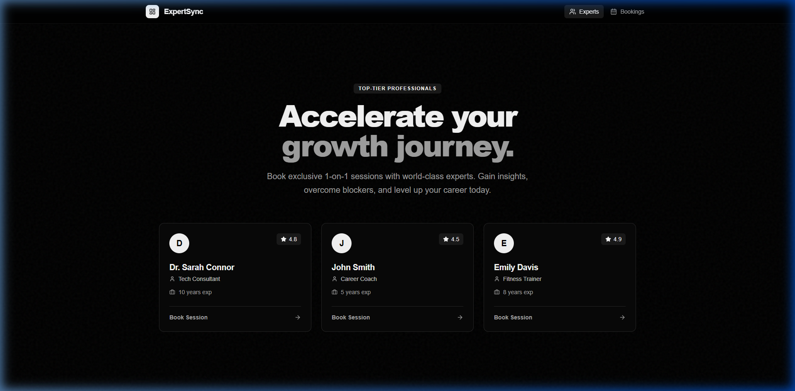
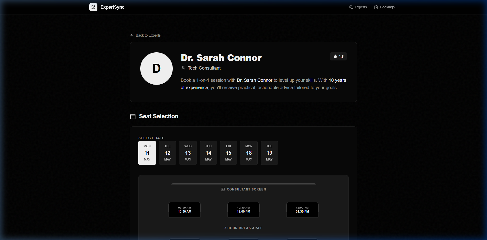

# ExpertSync: Real-Time Expert Booking System

ExpertSync is a high-performance, full-stack booking platform designed to connect users with top-tier professionals. It features a modern, minimalist monochrome aesthetic and an innovative "Cinema Seat" style booking interface.



## 🚀 Key Features

- **Innovative Booking Grid**: A movie-ticket style interface for selecting time slots, providing a tactile and intuitive user experience.
- **Real-Time Synchronization**: Powered by **Socket.io**, the app reflects booking status changes across all clients instantly.
- **Dynamic Slot Management**:
  - Precision 1.5-hour session blocks.
  - Automated 2-hour consultant breaks.
  - Smart weekend (Saturday/Sunday) exclusion.
- **Booking Management**: Complete user flow for searching bookings by email, tracking status, and performing one-click cancellations.
- **Persistent Storage**: Fully integrated with **MongoDB Atlas** for secure, cloud-hosted data management.

## 🛠️ Technology Stack

### Frontend
- **React (Vite)**: For a lightning-fast, modular UI development experience.
- **GSAP (GreenSock)**: Orchestrates smooth, hardware-accelerated animations and page transitions.
- **Lucide React**: Clean, consistent iconography.
- **Axios**: Robust HTTP client for API communication.
- **CSS3 (Vanilla)**: Customized high-fidelity styling without the constraints of generic frameworks.

### Backend
- **Node.js & Express**: A scalable foundation for the RESTful API.
- **TypeScript**: Ensures type safety and reduces runtime errors across the backend architecture.
- **Socket.io**: Enables real-time, bi-directional communication between client and server.
- **Mongoose**: Elegant MongoDB object modeling for data integrity.

## 🏗️ Architecture Showcase

### Cinema-Style Slot Selection
Instead of a boring list or dropdown, I implemented a grid-based selection system. This not only looks premium but also reduces the cognitive load on the user by clearly visualizing availability.



### Atomic Database Operations
To prevent double-booking in a real-time environment, the backend utilizes atomic MongoDB operations (`$addToSet`, `$pull`) and partial filter expressions. This ensures that even with high concurrency, the system remains consistent and reliable.

### Production Readiness
- **Monorepo Structure**: Organized for scale with separate `frontend` and `backend` services.
- **Render Deployment**: Optimized for automated CI/CD using `render.yaml` Blueprints.
- **Cloud Database**: Decoupled from local state using MongoDB Atlas.

---

## 💻 Installation & Setup

1. **Clone the repository**:
   ```bash
   git clone https://github.com/junaidansari096/expert-sync-booking.git
   ```

2. **Backend Setup**:
   ```bash
   cd backend
   npm install
   npm run dev
   ```

3. **Frontend Setup**:
   ```bash
   cd frontend
   npm install
   npm run dev
   ```

4. **Environment Variables**:
   Create a `.env` in the `backend/` folder with:
   - `MONGO_URI`: Your MongoDB connection string.
   - `PORT`: 5000

---

## 👨‍💻 Developer Note
Built with a focus on **Visual Excellence** and **Technical Robustness**. Every animation is carefully timed, and every database query is optimized to provide a "premium feel" that stands out to HRs and Technical Leads alike.
